**Self-taught developer building high-performance tooling and full-stack applications.**

---

## 🚀 About Me

- 🔭 Currently scaling and building out features at [luwan.io](https://luwan.io)
- 🛠️ Experienced in crafting desktop utilities, game addons, and modern web infrastructure
- 💡 Passionate about performance optimization and clean code architecture
- 👯 Open for new projects and exciting opportunities
- 📫 Reach me on Discord: **neon.real**

---

## 🔧 Tech Stack

**Languages:** JavaScript, TypeScript, Python, Rust, Go

**Frontend:** React, Vue, Next.js, Tailwind CSS

**Backend:** Node.js, Express, FastAPI, PostgreSQL

**Tools & DevOps:** Docker, Git, CI/CD, AWS

---

## 📊 GitHub Activity

---

## 📌 Connect With Me

🌐 [luwan.io](https://luwan.io) &nbsp;|&nbsp; 💬 Discord: **neon.real** &nbsp;|&nbsp; 🔗 [My Website](https://neeon-website.vercel.app/) &nbsp;|&nbsp; 📧 [Email Me](mailto:contact@example.com)

---

*Always learning, always building.*

